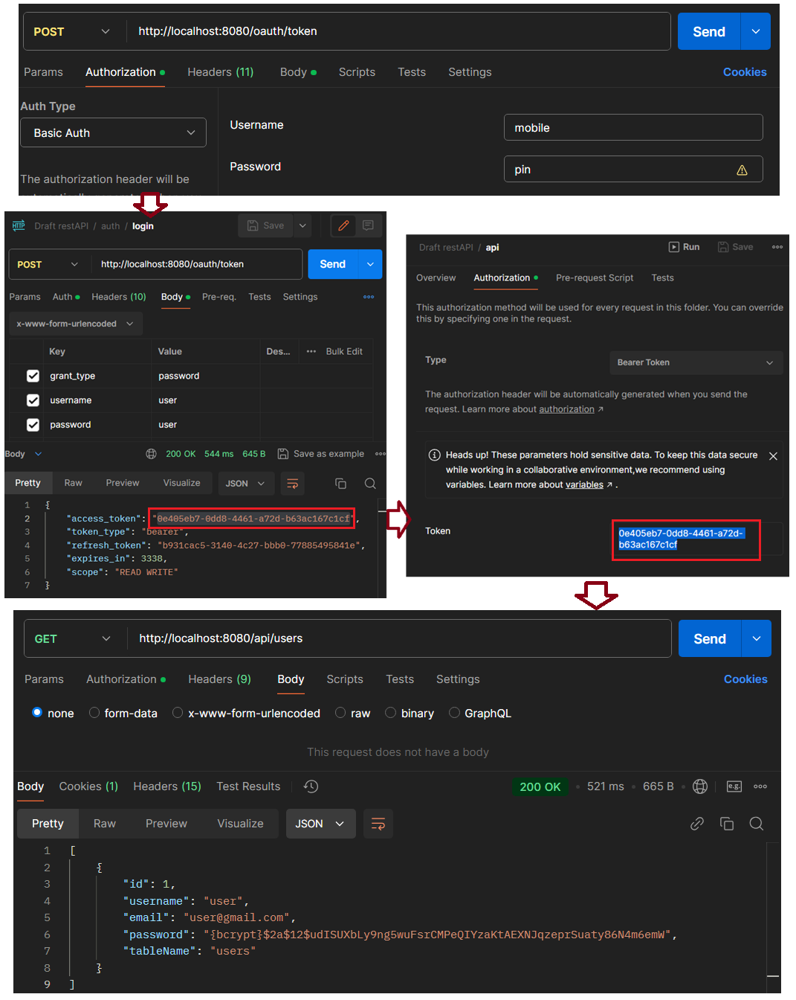
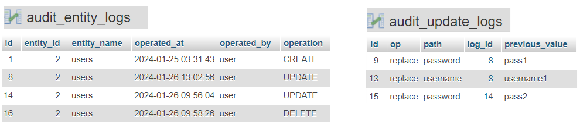

# Spring Boot Draft Rest API

Postman Documentation => https://documenter.getpostman.com/view/14869995/2sA35JyzJ9

## Get Started
Clone repository and run this command :
```
docker compose up
```

#### Import Postman Collection
Import the collection output from resources into postman so you can test the endpoints

#### Create a Database
Create a Database named "restapi_db" (Docker will create)

All necessary tables are created with generate-ddl from entities/models

#### Authentication
Firstly we need a client by insterting into `oauth_client_details` table.

Then, we need a user by insterting into `users` table.

**Liqubase** will create tables and insert demo datas (username=user, password=user).

Now we can verify our identity using http://localhost:8080/oauth/token endpoint.

Define the access_token we received from the auth/login endpoint in Postman as Bearer Token to the api collection. So all endpoints below the api collection will inherit



#### Role Hierarchy

Firstly insert roles
```sql
INSERT INTO roles(name, level) VALUES ('user', 1);
INSERT INTO roles(name, level) VALUES ('mod', 5);
INSERT INTO roles(name, level) VALUES ('alternative_mod', 5); -- at the same level, for different authorization from mod
INSERT INTO roles(name, level) VALUES ('admin', 10);
INSERT INTO roles(name) VALUES ('chosen'); -- independent of level hierarchy
```
then assign a role for a user
```sql
INSERT INTO user_roles (user_id, role_id) VALUES ('1', '1');
```

Also these inserts are included by **Liquibase**.

Now you can determine who can access what

### Audit Logger

Records CRUD operations made to entities defined in AuditListener and when and by whom (with authentication)

Since recording READ operations would overload the database, I disabled it. You can use it if you wish

In update operations, all detected changes are recorded in order to see the old versions




## Build & Deploy

run this command to build
```
mvn clean install
```

Then you can deploy the restapi_draft.war package that appears in the target folder.

Also don't forget to connect database to your server before building. Otherwise you may get an error during build.