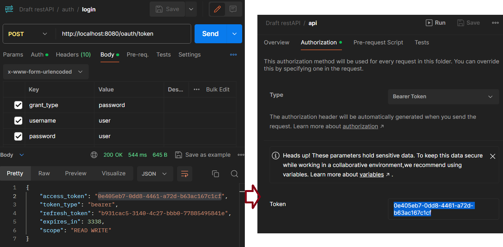

# Spring Boot Draft Rest API

Postman Documentation => https://documenter.getpostman.com/view/14869995/2sA35JyzJ9

## Get Started
Clone repository and run this command :
```
./mvnw spring-boot:run
```

#### Import Postman Collection
Import the collection output from resources into postman so you can test the endpoints

#### Create a Database
Create a Database named "restapi"

All necessary tables are created with generate-ddl from entities/models

#### Authentication
Firstly we need a Client
```sql
INSERT INTO oauth_client_details (client_id, client_secret, web_server_redirect_uri, scope, access_token_validity, refresh_token_validity, resource_ids, authorized_grant_types, authorities, additional_information, autoapprove) VALUES
('mobile', '{bcrypt}$2a$10$gPhlXZfms0EpNHX0.HHptOhoFD1AoxSr/yUIdTqA8vtjeP4zi0DDu', 'http://localhost:8080/code', 'READ,WRITE', 3600, 10000, 'microservice', 'authorization_code,password,refresh_token,implicit', NULL, '{}', NULL);

```

Then, we need a user (password is also "user")
```sql
INSERT INTO users (email, enabled, password, username) VALUES ('user@gmail.com', '1', '{bcrypt}$2a$12$udISUXbLy9ng5wuFsrCMPeQIYzaKtAEXNJqzeprSuaty86N4m6emW', 'user');
```

Now we can verify our identity using endpoint

Define the access_token we received from the auth/login endpoint in Postman as Bearer Token to the api collection. So all endpoints below the api collection will inherit



#### Role Hierarchy

Firstly insert roles
```sql
INSERT INTO roles(name, level) VALUES ('user', 1);
INSERT INTO roles(name, level) VALUES ('mod', 5);
INSERT INTO roles(name, level) VALUES ('alternative_mod', 5); -- at the same level, for different authorization from mod
INSERT INTO roles(name, level) VALUES ('admin', 10);
INSERT INTO roles(name) VALUES ('chosen'); -- independent of level hierarchy
```
then assign a role for a user
```sql
INSERT INTO user_roles (user_id, role_id) VALUES ('1', '1');
```

Now you can determine who can access what

### Audit Logger

Records CRUD operations made to entities defined in AuditListener and when and by whom (with authentication)

Since recording READ operations would overload the database, I disabled it. You can use it if you wish

In update operations, all detected changes are recorded in order to see the old versions


## Build & Deploy

run this command to build
```
mvn clean install
```

Then you can deploy the restapi_draft.war package that appears in the target folder.

Also don't forget to connect database to your server before building. Otherwise you may get an error during build.